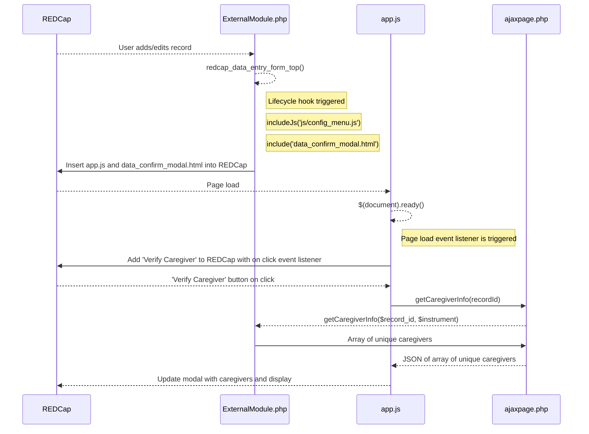

# Confirm Patient Data

A REDCap Module to search another project for data to ~populate data into~ display in the current form. This module is a hack of[Search and Populate Data from Another Project](https://github.com/ctsit/search_and_populate_data_from_another_project) intended to verify data in a satellite study.

## Limitations
This module does not support source projects which have multiple arms. All queries of the source project will be against arm 1 of the source project.

## Prerequisites
- REDCap >= 9.7.8

## Manual Installation
- Clone this repo into `<redcap-root>/modules/cbc_confirm_patient_data_v0.0.0`.
- Go to **Control Center > External Modules** and enable _CBC Confirm Patient Data_.
- For each project you want to use this module, go to the project home page, click on **Manage External Modules** link, and then enable _CBC Confirm Patient Data_ for that project.

## Configuration
Access **Manage External Modules** section of your project, click on _Search and Populate Data From Another Project_'s configure button, and save settings in order to specify the forms where the query box should be visible and provide the field mapping for each of those forms.

- **Project you wish to search**: The source project you will be searching and pulling values from.
    - **Note**: You may only select source projects to which you have access, but user permissions are _not_ checked while the module is used; by defining a source project you are granting access to the data contained in its mapped fields for everyone with access to the target project, _even for users without access to the source project_.
- **Limit fields to search**: Require selection of a single field to search from the source project.
    - Improves performance with large source projects
- **Enabled forms**
    - **Show in this form**: The instrument the following mapping will be applied to.
    - **JSON array of fields from source project**: JSON array of `source_field_names` from the source project to display to users in your current project.

## Diagrams

### Sequence Diagrams

